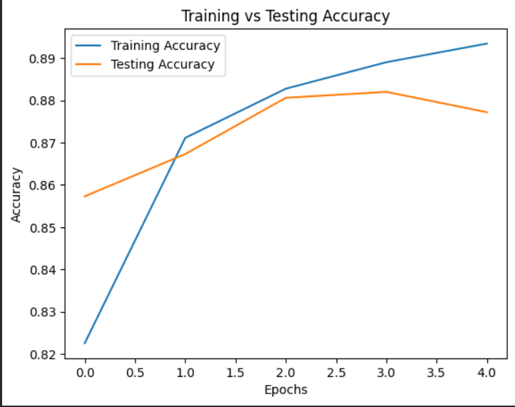
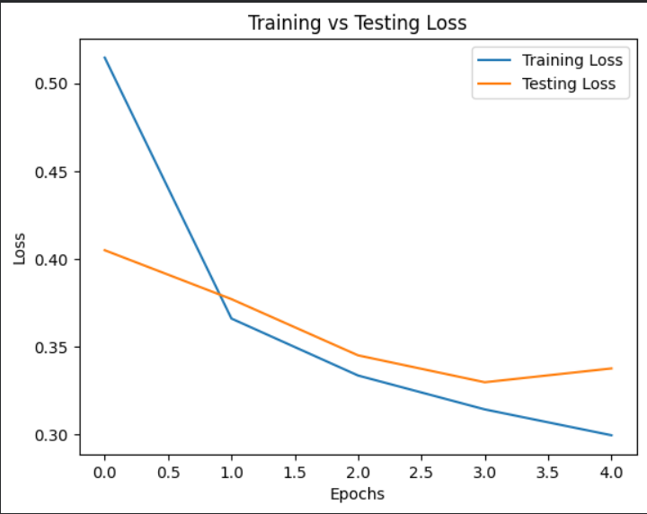

# Fashion MNIST CNN using Deep Learning

- **Course:** Deep Learning Theory and Practices
- **Assignment:** CNN Implementation using Fashion MNIST
- **SRN:** PES1PG25CS098

---

# Project Overview

This project implements a Convolutional Neural Network (CNN) for image classification on the Fashion MNIST dataset using TensorFlow, Keras, and NumPy.

The objective of this assignment is to understand the internal working of Convolutional Neural Networks including:

- Convolution Layer
- Pooling Layer
- Flatten Layer
- Fully Connected Layer
- Forward Pass
- Backpropagation
- Training and Evaluation

The model was trained on the Fashion MNIST dataset and achieved approximately **87.72% test accuracy**.

---

# About Fashion MNIST Dataset

Fashion MNIST is a dataset of grayscale clothing images containing 70,000 images divided into 10 classes.

Each image:

- Size: 28 × 28 pixels
- Color Format: Grayscale
- Total Classes: 10

The dataset contains images of:

- T-shirts
- Shoes
- Bags
- Dresses
- Coats
- Sandals
- Shirts
- Sneakers
- Pullovers
- Ankle boots

Dataset Split:

- Training Images: 60,000
- Testing Images: 10,000

---

# Libraries Used

| Library | Purpose |
|----------|----------|
| TensorFlow | Building and training CNN |
| NumPy | Numerical operations |
| Matplotlib | Plotting graphs |

---

# CNN Architecture

The CNN model contains the following layers:

---

## 1. Convolution Layer

```python
Conv2D(8, (3,3), activation='relu')
```

### Purpose

The convolution layer extracts important visual features from the image such as:

- edges
- textures
- shapes
- patterns

### Working

- 8 filters are applied to the image.
- Each filter size is 3×3.
- Filters slide across the image and perform convolution operations.
- Feature maps are generated.

### Why ReLU?

ReLU activation introduces non-linearity and helps the network learn complex patterns.

Formula:

```python
f(x) = max(0, x)
```

---

## 2. Max Pooling Layer

```python
MaxPooling2D((2,2))
```

### Purpose

Pooling reduces the spatial dimensions of the feature maps.

### Advantages

- Reduces computation
- Prevents overfitting
- Retains important features

### Working

The 2×2 window selects the maximum value from each region.

Example:

```python
[1 5]
[2 3]
```

Output:

```python
5
```

---

## 3. Flatten Layer

```python
Flatten()
```

### Purpose

Converts multidimensional feature maps into a one-dimensional vector.

### Why Needed?

Dense layers require 1D input.

---

## 4. Fully Connected Dense Layer

```python
Dense(10, activation='softmax')
```

### Purpose

Predicts probabilities for 10 clothing classes.

### Why Softmax?

Softmax converts outputs into probability distribution.

Example:

```python
Class probabilities:
[0.01, 0.90, 0.03, ...]
```

Highest probability becomes predicted class.

---

# Model Compilation

```python
model.compile(
    optimizer='adam',
    loss='sparse_categorical_crossentropy',
    metrics=['accuracy']
)
```

---

## Optimizer: Adam

Adam optimizer adjusts learning rates automatically and improves convergence speed.

Advantages:

- Fast convergence
- Stable training
- Efficient gradient updates

---

## Loss Function: Sparse Categorical Crossentropy

Used for multi-class classification problems.

Measures prediction error between:

- predicted probabilities
- actual labels

Lower loss indicates better predictions.

---

# Training Process

The model was trained for:

```python
5 epochs
```

---

# Epoch-wise Analysis

| Epoch | Training Accuracy | Validation Accuracy | Training Loss | Validation Loss |
|------|-------------------|--------------------|---------------|----------------|
| 1 | 82.26% | 85.73% | 0.5145 | 0.4049 |
| 2 | 87.11% | 86.73% | 0.3660 | 0.3771 |
| 3 | 88.27% | 88.06% | 0.3336 | 0.3451 |
| 4 | 88.90% | 88.20% | 0.3143 | 0.3298 |
| 5 | 89.34% | 87.72% | 0.2996 | 0.3376 |

---

# Analysis of Training Results

## Accuracy Improvement

The training accuracy increased steadily from:

```python
82.26% → 89.34%
```

This indicates that the CNN successfully learned important image features.

---

## Loss Reduction

The training loss reduced from:

```python
0.5145 → 0.2996
```

This shows:

- prediction errors reduced
- model confidence improved
- network weights optimized successfully

---

## Validation Performance

Validation accuracy improved continuously and reached:

```python
88.20%
```

Final test accuracy achieved:

```python
87.72%
```

This demonstrates good generalization on unseen data.

---

# Final Model Performance

| Metric | Value |
|--------|--------|
| Test Accuracy | 87.72% |
| Test Loss | 0.3376 |

---

# Accuracy Graph

The following graph shows the improvement in training and validation accuracy over epochs.



---

# Loss Graph

The following graph shows the reduction in training and validation loss over epochs.



---

# Key Learnings

Through this assignment, the following concepts were understood:

- Working of convolution operations
- Feature extraction in CNNs
- Pooling operations
- Dense neural layers
- Backpropagation
- Model optimization
- Loss minimization
- CNN training workflow
- Deep learning model evaluation

---

# Project Structure

```text
UE24CS645BC2_PES1PG25CS098_Fashion_MNIST_CNN
│
├── Fashion_MNIST_CNN.ipynb
├── README.md
├── accuracy_graph.png
└── loss_graph.png
```

---

# How to Run

## Step 1

Open Google Colab.

## Step 2

Upload the notebook file.

## Step 3

Run all cells sequentially.

## Step 4

The model will train automatically and generate:

- accuracy graphs
- loss graphs
- evaluation metrics

---

# Conclusion

This project successfully implemented a CNN model for Fashion MNIST image classification.

The model achieved approximately 88% accuracy and demonstrated how convolutional neural networks learn hierarchical image representations through convolution, pooling, flattening, and dense layers.

The assignment provided practical understanding of CNN architecture, forward propagation, backpropagation, and model evaluation techniques in deep learning.
